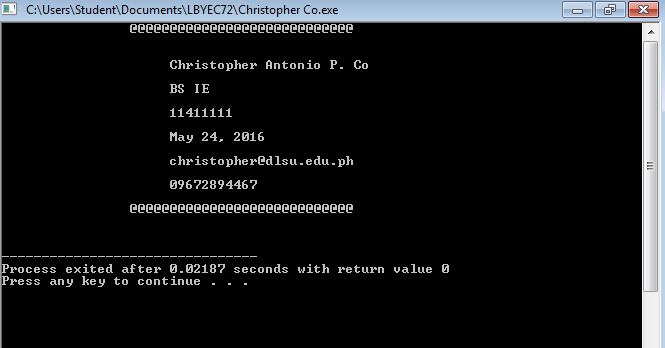

# HelloFromChristopherCo
```

#include <stdio.h>
#include <stdlib.h>

int main()
{
	puts("\t\t@@@@@@@@@@@@@@@@@@@@@@@@@@@@\n\n");
	puts("\t\t     Christopher Antonio P. Co\n");
	puts("\t\t     BS IE\n");
	puts("\t\t     11411111\n");
	puts("\t\t     May 24, 2016\n");
	puts("\t\t     christopher@dlsu.edu.ph\n");
	puts("\t\t     09672894467\n");
	puts("\t\t@@@@@@@@@@@@@@@@@@@@@@@@@@@@\n\n");
	system("PAUSE");
	return 0;
}
```


